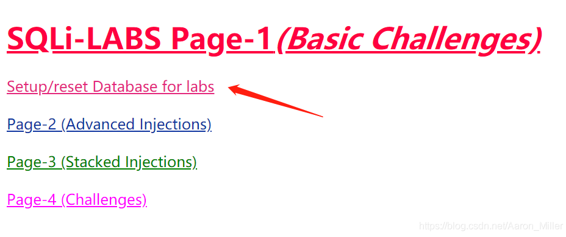
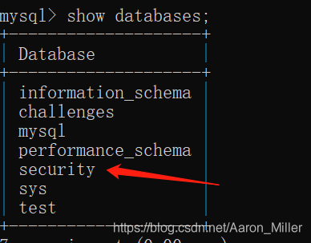

### 1、sqli-labs安装

##### 环境搭建(本机使用的是linux服务器)---可使用apache或者其他的集成环境(Lamp---Linux-Apache-MySQL-PHP)

##### Lamp说明：

LAMP是指一组通常一起使用来运行动态网站或者服务器的自由软件名称首字母缩写：\
Linux，操作系统 Apache，网页服务器\
MariaDB或MySQL，数据库管理系统或数据库服务器\
PHP、Perl或Python，脚本语言

##### 安装httpd、php、mysql等服务

```bash
yum install httpd php php-mysql php-gd mariadb mariadb-server -y
```

##### 初始化数据库(按照安全初始化脚本提示输入密码以及一系列的y加回车)

```bash
systemctl enable mariadb && systemctl start mariadb &&mysql_secure_installation
```

 ###### 安装sqli-labs靶机 [GitHub项目地址](https://github.com/Audi-1/sqli-labs)：https://github.com/Audi-1/sqli-labs

 ###### 启动服务---apache的服务

 ###### 将sql-labs解压到站点目录

 ###### 进入到sqli-labs靶机站点，点击重置数据库即可在mysql中创建了数据库



